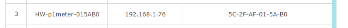

# Fg.HomeWizard.EnergyApi.Client

[](https://frederikgheysels.visualstudio.com/GitHub%20Pipelines/_build/latest?definitionId=11&branchName=main)
[](https://www.nuget.org/packages/fg.homewizard.energyapi.client/)

This library offers an easy integration with the HomeWizard Energy API.
It is available via NuGet and can be installed via:

# Installation

```
PM> Install-Package Fg.HomeWizard.EnergyApi.Client
```

# Usage

To be able to retrieve data that is exposed by your HomeWizard P1 device, you first need to know the hostname of your P1 meter.  When your P1 meter is connected with your network, you'll be able to find the hostname in your _Host Clients_ list in your router.  For instance:



Find your `HomeWizardDevice` in your network using its hostname with the `HomewizardDeviceResolver`:

```csharp
HomeWizardDevice device = 
    await HomeWizardDeviceResolver.FindHomeWizardDeviceAsync("p1meter-015AB0", logger);
```
> Notice that you need to remove the `HW-` part of the hostname.

Once the device has been found, you can instantiate a `HomeWizardService` instance and read out the last readings via the code below:

```csharp
HomeWizardService service = new HomeWizardService(device);

Measurement currentMeasurement = await service.GetCurrentMeasurementsAsync();
```